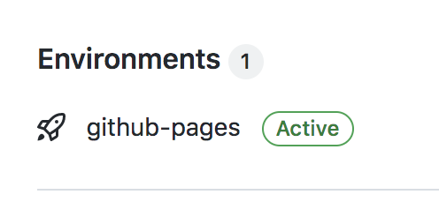

# How to find the url of your github pages 

If you've activated GH pages then you should see this "Github pages" link on your repo.

Click on this link. Then click on the "view deployment" button.

That will take you to your deployed GH site.
